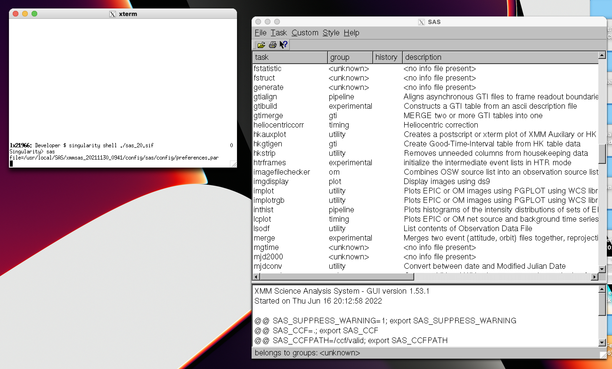

# Docker & Singularity

_This guide is heavily work-in-progress, as reproducible environment and development containers is a very broad topic. Please open an issue if something is unclear._

<!--BEGIN TOC-->

## Table of Contents

1. [Singularity](#singularity)
   1. [Quickstart](#quickstart)
   2. [Running docker containers on the astrophysics servers](#running-docker-containers-on-the-astrophysics-servers)
   3. [X11 support](#x11-support)

<!--END TOC-->

## Singularity <a id="toc-tag-mdtoc" name="singularity"></a>

Singularity is a container runtime environment for linux, and is available on the astrophysics servers.

- [Singularity documentation](https://docs.sylabs.io/guides/3.7/user-guide/)

### Quickstart <a id="toc-tag-mdtoc" name="quickstart"></a>

- ports are automatically bound to host network
- CWD automatically "mounted"

### Running docker containers on the astrophysics servers <a id="toc-tag-mdtoc" name="running-docker-containers-on-the-astrophysics-servers"></a>

With singularity, we can convert docker containers to the _Singularity Image Format_ (SIF) and execute these directly on the astrophysics servers.

Singularity can already pull container images from a variety of registries, including dockerhub. From the `pull` help page:

> ```
> Supported URIs include:
>
>  library: Pull an image from the currently configured library
>     library://user/collection/container[:tag]
>
>  docker: Pull a Docker/OCI image from Docker Hub, or another OCI registry.
>     docker://user/image:tag
>
>  shub: Pull an image from Singularity Hub
>     shub://user/image:tag
>
>  oras: Pull a SIF image from an OCI registry that supports ORAS.
>     oras://registry/namespace/image:tag
>
>  http, https: Pull an image using the http(s?) protocol
>     https://library.sylabs.io/v1/imagefile/library/default/alpine:latest
> ```

If the container you wish to run is hosted in one of the above registries, then you can directly pull and convert the container to SIF, e.g.

```bash
singularity pull my_image.sif docker://username/myimage:latest
```

If the docker image is one that you are building yourself, or downloaded from a vendor (e.g. the [XMM SAS image](https://github.com/astro-group-bristol/astro-software-installers/blob/main/sas/README.md)), the easiest way to create a SIF image is by re-building the image layers directly on the astrophysics servers. Ensure the image you have is for x86/64 architecture, and then export the image as a `.tar` using the `docker save` command:

```bash
docker save username/myimage:latest > my_image.tar
```

Upload the file to the astrophysics servers, and re-build the container as a SIF:

```bash
singularity build --sandbox my_image.sif docker-archive:///absolute/path/to/file
```

- the `--sandbox` flag ensures that root privileges are disabled, and keeps the entire image archive in a single directory structure

Relative file-paths to the archive can be passed with `./`.

- Example: XMM SAS

```bash
singularity build --sandbox sas_20.sif docker-archive://./sas_20_0_docker.tar
```

The docker container's context can now be shelled into

```bash
singularity shell sas_20.sif
```

### X11 support <a id="toc-tag-mdtoc" name="x11-support"></a>

Singularity automatically receives the X11 context and display server from the shell which executes it.

- Example: XMM SAS and OSX user

Shell into the astrophysics servers using [XQuartz](https://www.xquartz.org/), passing the `-X` flag to your `ssh` command to forward X11. Then, shell into the XMM SAS SIF image

```bash
singularity shell sas_20.sif
```

Any graphical interfaces which now start will be shown directly on your machine:

<p align="center">

</p>
