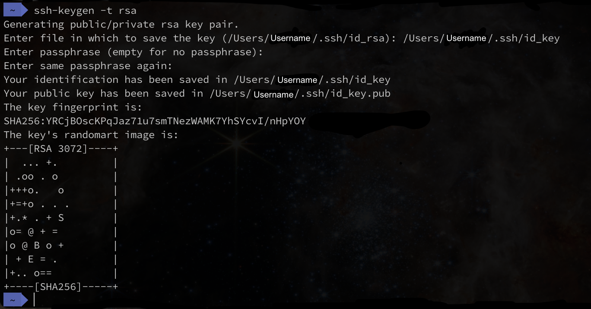

# How to be an SSH Master.

This guide will help you use ```ssh``` more effectively and improve your experience remoting into the astrophyiscs servers.
## Table of Contents
1. [.ssh/config - SSH configuration file](#sshconfig---ssh-config-file)
2. [Using SSH Keys](#using-ssh-keys)
3. [Adding SSH Key to .ssh/config](#adding-ssh-key-to-sshconfig)

## .ssh/config - SSH config file

You probably know how to use the ```ssh``` command from the terminal to access the astrophysics servers, but the last thing you would want to do is type it out every time. This gets just gets tedious. 

Instead we can save our ```ssh``` connection details in the ssh configuration file. To do this you can the following.

1. Use a text editor to open the ```ssh``` config file on your personal computer.
   ```bash
   $ vim ~/.ssh/config 
   ```
   You can use any text editor, here I have used ```vim```. Also ```~``` makes sure you are referencing your home directory. 

2. You should have an empty file, but if not just place the following underneath what is already there. In this file we can add details of different ```ssh``` destinations and name them. This follows the structure of the following:
   ```bash
   Host HOSTNAME
      SSH_OPTION value
      SSH_OPTION value

   ```
3. An example configuration you might want follows:
   ```bash
   Host typhon
        HostName TYPHON_ADDRESS
        User USERNAME
        ProxyJump aquila
    
   Host aquila
        HostName AQUILA_ADDRESS
        User USERNAME
   ```
   This is the equivalent of the following ```ssh``` commands.
   ```bash
   $ ssh -J USER@AQUILA USER@TYPHON
   $ ssh USER@AQUILA 
   ```

   Make sure you replace ```AQUILA_ADDRESS```, ```TYPHON_ADDRESS``` and ```USERNAME``` with their addresses and your username and save the file. With ```vim``` this can be done with ```:wq``` in command mode (to enter command mode press ESC key). Then try it out! Simply type ```ssh aquila``` or ```ssh typhon``` into the commandline, insert your password(s) and your in! 

## Using SSH Keys

If you do not want to keep inserting your password, you can instead use a SSH key to authenticate your connection.

First you will need to generate a private and public key (this is simply a long sequence of numbers and letters). You can do this using the following.
```bash
$ ssh-keygen -t rsa
```
This will prompt you for the following: 
- ```FILENAME```: If this is your first time you can use the default name, or name it something useful.
- ```passphrase```: This can be skipped but should not as it will create a security vulnerability to the astrophysics servers as anyone with access to this file can enter the network.

Once this is done you should have received an output like this.
<a align="center">

</a>

Your public key will then need to be added to the server to use the ```ssh``` key for 
authentication. 

Your ```ssh``` key can be added to your hosts information by adding the following to the appropriate host. The easiest way to do this using the ```ssh-copy-id``` command. Type the following:
```bash
$ ssh-copy-id USER@AQUILA
```
Note: you only need to send the public key to AQUILA for it to work on all the servers as they share the same file system.

You should test that this worked by remoting into the server, you should get a passphrase prompt (or no prompt if you didn't set a passphrase).

## Adding SSH key to .ssh/config

To add this key to your config file, add the additional line, ```IdentityFile``` and the location of the private key, for the appropriate Host.
```bash
Host AQUILA
   HostName AQUILA_ADDRESS
   User USERNAME
   IdentityFile ~/.ssh/id_rsa
```
This ```IdentityFile``` ```ssh``` option and private key path can also be added to the ```ssh``` Host created by VScode in [Using VSCode's remote SSH features](../guides/vs-code-ssh.md) guide. 